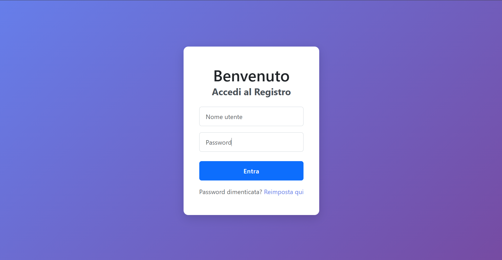
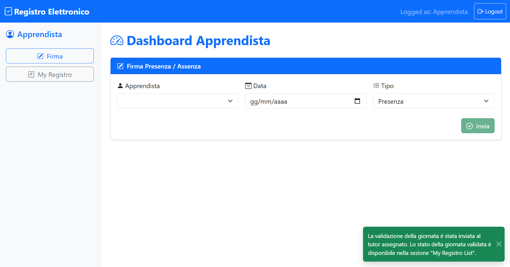
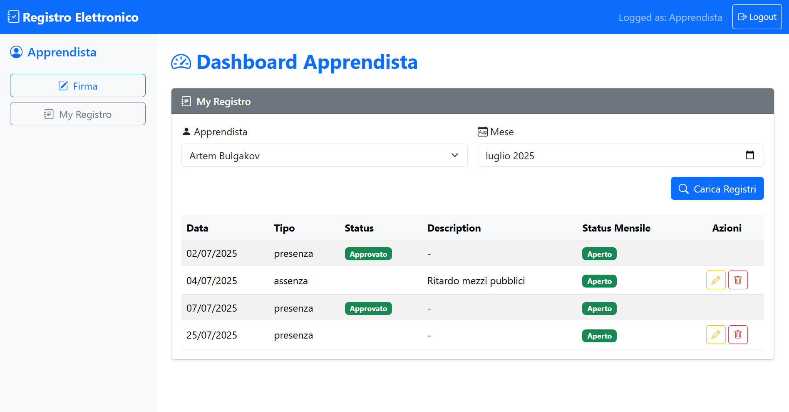
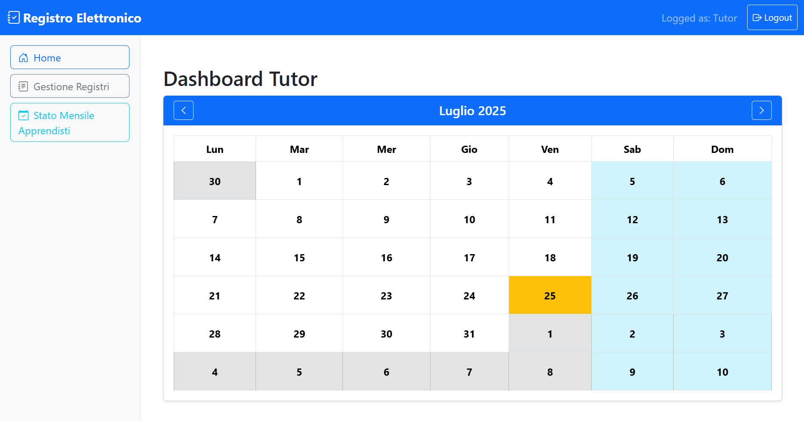
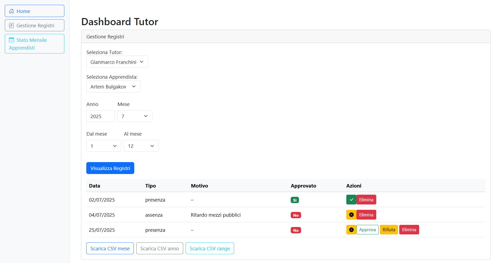
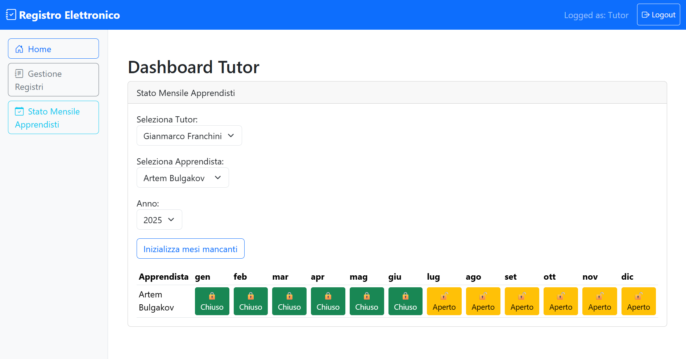
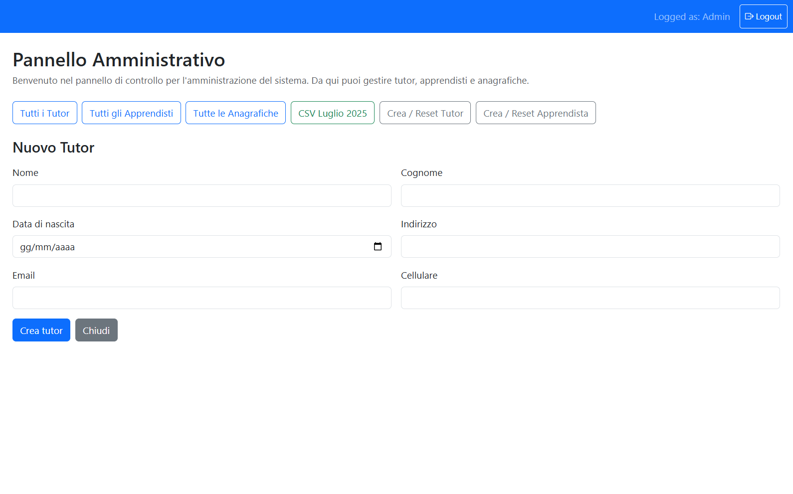
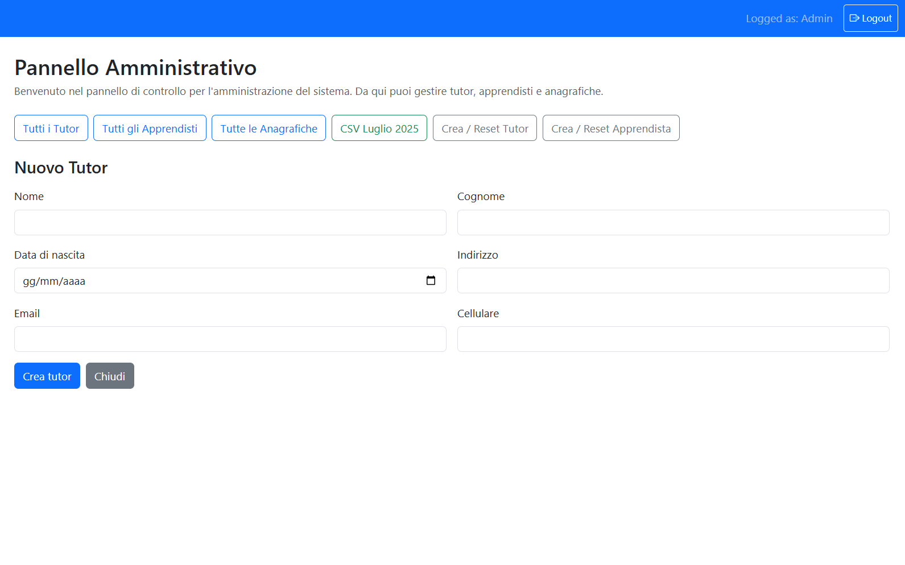

# 🚀 Registro Elettronico – Full-Stack Web Application  
*(Showcase repository – repository di presentazione)*

---

## 🇮🇹 Descrizione (Italiano)  
**Registro Elettronico** è una web application full-stack sviluppata con **Spring Boot 3** e **Angular 17**, progettata per sostituire i registri cartacei delle presenze con una piattaforma digitale sicura e basata sui ruoli (Tutor, Apprendista, Amministratore).  

> **Nota:** Questo repository contiene **solo screenshot** e materiali visivi del progetto.  
> Il codice sorgente è **proprietà di Reale Group** e non è pubblicamente disponibile.

---

## 🇬🇧 Description (English)  
**Registro Elettronico** is a full-stack web application built with **Spring Boot 3** and **Angular 17**, designed to replace paper attendance books with a secure, role-based digital platform (Tutor, Apprentice, Administrator).  

> **Note:** This repository includes **only screenshots** and visual materials.  
> The source code is **proprietary to Reale Group** and is not publicly available.

---

## 🖼️ Screenshots / Screenshot

  
*Pagina di login dell’applicazione.*

  
*Sezione firma presenze per l’apprendista.*

  
*Visualizzazione del registro personale dell’apprendista.*

  
*Pagina principale del Tutor con Calendario.*

  
*Dashboard Tutor per la gestione dei registri.*

  
*Stato mensile degli apprendisti monitorato dal Tutor con "Apri/Chiudi"-mese funzionalita.*

  
*Form per la creazione di un nuovo Tutor.*

  
*Form per la creazione di un nuovo Apprendista.*

---

## 🏗️ Tech Stack / Stack Tecnologico  
- **Backend:** Java 17 • Spring Boot 3 (REST, DTO, Swagger)  
- **Frontend:** Angular 17 (standalone) • RxJS • Bootstrap 5  
- **Database:** H2 → PostgreSQL-ready  
- **Security:** Role-based guards • Input sanitisation  
- **CI/DevOps:** Maven Wrapper • Docker-ready

---

## 👥 Credits / Crediti  
**Backend Development Team:**  
- Lorenzo Torres – <lorenzo.torres@edu-its.it>  
- Artem Bulgakov – <artem.bulgakov@edu-its.it>  
- Andrea Scarrone – <andrea.scarrone@edu-its.it>  
- Matteo Cai – <matteo.cai@edu-its.it>  
- Francesco Ciancaglini – <francesco.ciancaglini@edu-its.it>  

**Frontend Development (Supervised):**  
- Artem Bulgakov – <artem.bulgakov@edu-its.it> (developer)  
- Emanuele Fricano – <emanuele.fricano@realeites.com> (supervisor)

---

## 📜 License / Licenza  
**MIT License**  

Copyright (c) 2025 Reale Group  

This repository contains visual materials (screenshots) of the *"Registro Elettronico"* project, a proprietary internal application developed by Reale Group.  
For inquiries, please contact the development team or Reale Group directly.  

---

## 🔗 Links / Collegamenti  
- **LinkedIn Project Page:** [https://www.linkedin.com/in/artem-bulgakov-8a5171227/]  
- **Team ITS Reale ITES:** [https://www.realegroup.eu/it](https://www.realegroup.eu/IT/corporate/gruppo-e-organi-sociali/servizi/reale-ites-srl)

